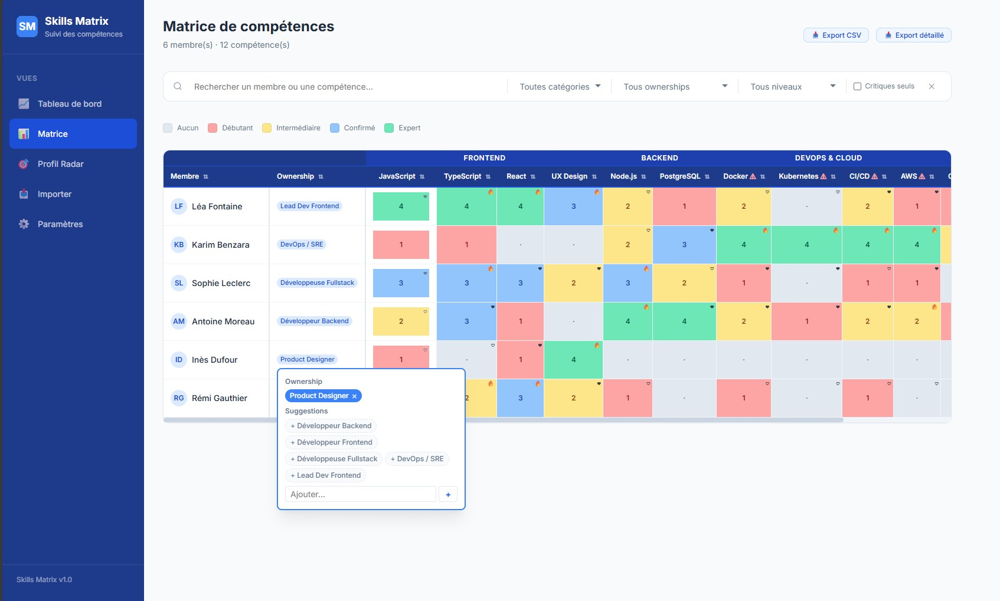
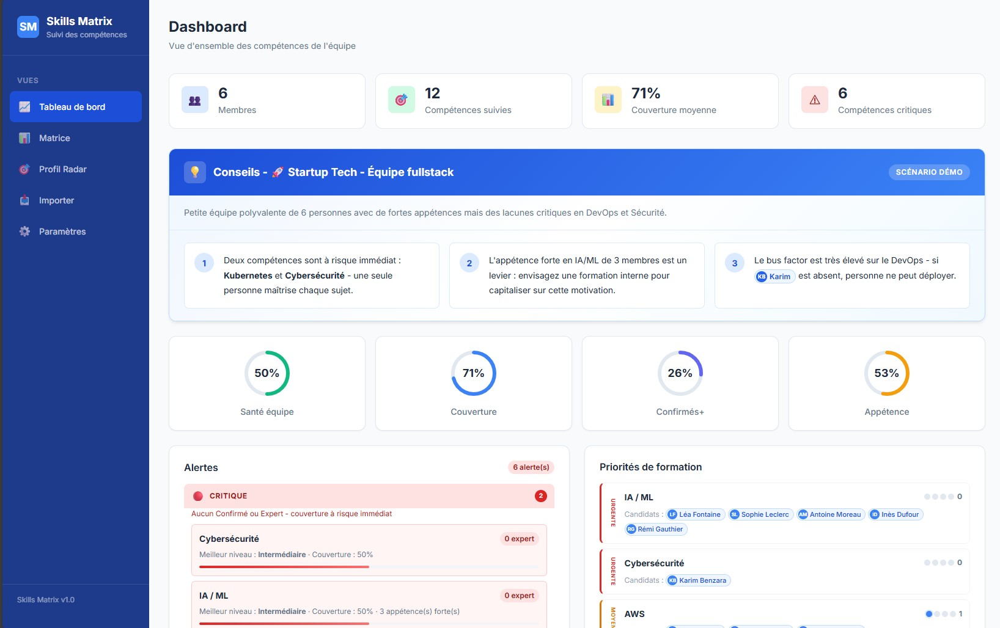
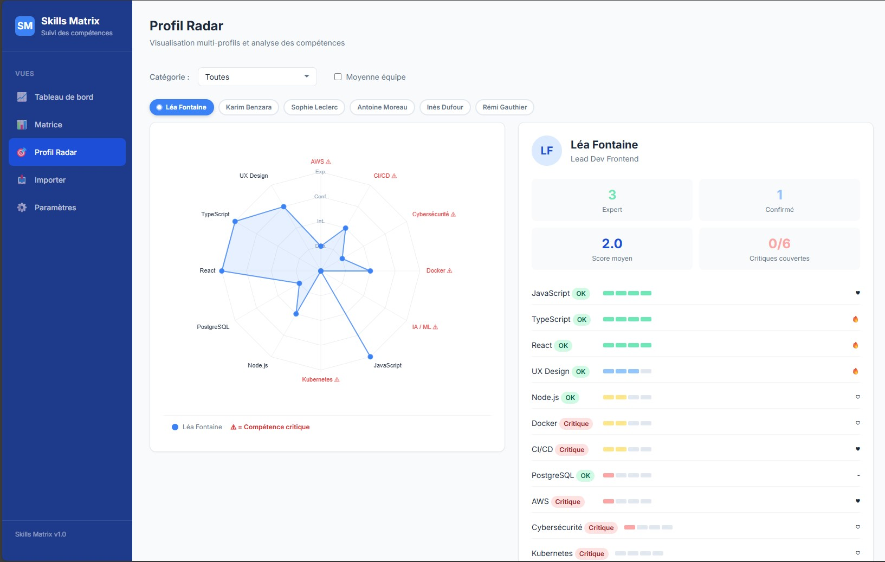

# 📊 Skills Matrix `v2.0.0`

> Visualisez les competences de votre equipe en un coup d'oeil.
> Identifiez les lacunes critiques.
> Priorisez les formations.
> Le tout sans framework, sans build, en vanilla JS.

---

## 💡 Pourquoi Skills Matrix ?

Chaque equipe a un tableur de competences qui dort dans un Drive. **Skills Matrix** le transforme en outil vivant :

- 📋 **Collez vos donnees** depuis Excel ou Google Sheets, c'est parti
- 🔍 **Reperez en 2 secondes** qui maitrise quoi grace a la heatmap couleur
- 🚨 **Identifiez les risques** : competences critiques couvertes par une seule personne
- 🎯 **Comparez les profils** avec des radars superposables
- ⚡ **Zero install** : un navigateur suffit pour consulter

---

## 🚀 Demarrage rapide

### Option 1 : Mode complet (avec templates persistants)

Le mode recommande. Les templates sont sauvegardes en fichiers JSON sur votre machine.

```bash
# 1. Installer les dependances (une seule fois)
npm install

# 2. Lancer le serveur (au choix)
npm start                      # Direct (premier plan, logs dans le terminal)
npm run pm2                    # Via PM2 (arriere-plan, redemarrage auto)

# 3. Ouvrir dans votre navigateur
#    http://localhost:5500
```

**Avec PM2** (recommande pour un usage au quotidien) :
```bash
npm run pm2                    # Demarrer en arriere-plan
npm run pm2:stop               # Arreter
npm run pm2:logs               # Voir les 30 derniers logs
```

> **C'est quoi PM2 ?** Un gestionnaire de processus Node.js. Il garde le serveur en vie en arriere-plan
> et le relance automatiquement en cas de crash. Installez-le avec `npm install -g pm2`.

> **C'est quoi `npm` ?** C'est le gestionnaire de paquets de Node.js.
> Si vous ne l'avez pas, installez Node.js depuis [nodejs.org](https://nodejs.org/) (choisissez la version LTS).
> Apres installation, `npm` sera disponible dans votre terminal.

### Option 2 : Mode leger (sans serveur)

Fonctionne sans rien installer. Les templates personnalises seront sauvegardes dans le navigateur (localStorage) au lieu de fichiers.

```bash
# Au choix :
npx serve .                    # Si vous avez Node.js
python -m http.server 5500     # Si vous avez Python
# Ou "Go Live" dans VS Code   # Extension Live Server
```

> **Pourquoi un serveur HTTP ?** L'app utilise les modules ES natifs (`import`/`export`), qui necessitent le protocole HTTP. Ouvrir `index.html` directement ne fonctionnera pas.

### ⚖️ Difference entre les deux modes

| | Mode complet (`npm start`) | Mode leger (serveur statique) |
|---|---|---|
| 👀 Consultation | ✅ Oui | ✅ Oui |
| 📥 Import de donnees | ✅ Oui | ✅ Oui |
| 🎮 Demos | ✅ Oui | ✅ Oui |
| 💾 Sauvegarde auto (localStorage) | ✅ Oui | ✅ Oui |
| 📦 Creer des templates | Fichiers JSON dans `templates/` | localStorage (navigateur) |
| 🔗 Partager un template | Copier le fichier `.json` | Pas possible |

L'app detecte automatiquement la presence du serveur. Si le serveur n'est pas lance, un message vous previent et les templates sont sauvegardes localement.

---

## ✨ Fonctionnalites

| Vue | Description |
|-----|-------------|
| 🗂️ **Matrice** | Tableau heatmap membres x competences, edition inline, tri multi-colonnes, badges d'appetence |
| 📈 **Dashboard** | KPIs de couverture, alertes competences critiques, priorites de formation, mentorat |
| 🕸️ **Radar** | Graphique radar par membre, comparaison multi-profils (jusqu'a 5), overlay moyenne equipe |
| 📥 **Import** | Collage depuis Excel/Sheets, upload CSV, demos en 1 clic, templates personnalises |
| ⚙️ **Parametres** | Seuils de criticite, gestion des categories, delimiteur CSV, export/import JSON complet |

**Transversal :**
- 🔎 Filtres avances (recherche, categorie, role, niveau, criticite)
- 💾 Sauvegarde automatique en `localStorage` a chaque modification
- 📤 Export CSV simple, CSV detaille et JSON (backup complet)
- 🏷️ Categories de competences avec auto-categorisation
- 🔗 URLs partageables (`#dashboard`, `#matrix`, `#radar`, `#import`, `#settings`)

---

## 📦 Templates

Les templates permettent de pre-charger une equipe complete (membres, competences, categories) en un clic.

### 🏗️ Templates inclus (built-in)

Un template de demonstration est fourni : **Tribu Value** (17 coachs, 22 competences).
Ces templates sont commites dans le depot git (`templates/*.json`) et ne peuvent pas etre supprimes depuis l'interface.

### ➕ Creer un template

1. Chargez ou importez vos donnees dans l'application
2. Allez dans la vue **Import** > section **Templates personnalises**
3. Cliquez sur **+ Creer**
4. Renseignez un nom et une description
5. Le template est enregistre en tant que fichier `.local.json` dans `templates/` (mode complet) ou dans le navigateur (mode leger)

Les fichiers `.local.json` sont **ignores par git** (via `.gitignore`), donc vos templates personnels ne polluent pas le depot.

### 🔗 Partager un template

En mode complet, chaque template cree est un fichier `.local.json` dans le dossier `templates/`. Pour le partager :
- Copiez le fichier (ex : `mon-equipe.local.json`) et envoyez-le a votre collegue
- Votre collegue le place dans son dossier `templates/` et relance le serveur
- Pour rendre un template permanent (commite dans git), renommez-le en `.json` (sans `.local`) et ajoutez-le dans `templates/index.json`

En mode leger, utilisez le bouton **Exporter** pour telecharger le JSON, puis **Importer .json** chez le destinataire.

---

## 📋 Format d'import

La premiere ligne contient les en-tetes. Les colonnes sont :

| Colonne | Contenu | Obligatoire |
|---------|---------|:-----------:|
| 1 | Nom | ✅ |
| 2 | Role (Ownership) | ✅ |
| 3 | Appetences generales | ❌ |
| 4 | Groupes (missions, tribus...) | ❌ |
| 5+ | Competences | ✅ (au moins 1) |

Exemple :
```
Nom;Role;Appetences;Groupes;JavaScript;React;Python
Jean Dupont;Developpeur;IA, Cloud;Mission X, Tribu Data;4/3;3/2;1/1
Marie Martin;Tech Lead;Architecture;Mission Y;3/2;4/3;2/0
```

Chaque cellule de competence suit le format **`niveau/appetence`** :

| Niveau | Signification | | Appetence | Signification |
|:------:|---------------|---|:---------:|---------------|
| 0 | Aucun | | 0 | Aucune |
| 1 | Debutant | | 1 | Faible |
| 2 | Intermediaire | | 2 | Moyen |
| 3 | Confirme | | 3 | Fort |
| 4 | Expert | | | |

> Exemple : `3/2` = Confirme + Appetence Moyenne

**Delimiteurs supportes :** tabulation (copier-coller Excel/Sheets), point-virgule (`;`), virgule (`,`). Auto-detecte.

---

## 🖼️ Apercu des vues

### 🗂️ Matrice heatmap

Tableau membres x competences avec heatmap couleur, edition inline (niveau + appetence), tri multi-colonnes et filtres avances.



### 📈 Dashboard

KPIs de couverture, anneaux de sante, alertes critiques, priorites de formation, section Developpement & Mentorat.



### 🕸️ Radar comparatif

Graphique radar par membre avec comparaison multi-profils (jusqu'a 5), overlay moyenne equipe.



---

## 🏛️ Architecture

```
skills-matrix/
├── index.html                # Point d'entree unique (SPA)
├── package.json              # Dependances serveur (Express) + scripts PM2
├── ecosystem.config.cjs      # Configuration PM2 (watch, env)
├── server.js                 # Mini serveur Express (API templates + fichiers statiques)
├── templates/                # Templates JSON (1 fichier = 1 template)
│   ├── index.json            # Manifeste des templates built-in
│   ├── tribu-value.json      # Template de demo (built-in, commite)
│   └── *.local.json          # Templates crees via l'app (gitignores)
├── css/
│   ├── variables.css         # Design tokens (couleurs, typo, spacing)
│   ├── base.css              # Reset, layout global
│   ├── components.css        # Composants UI reutilisables
│   ├── matrix.css            # Heatmap et edition inline
│   └── charts.css            # Dashboard et graphiques
└── js/
    ├── app.js                # Init, routing hash (#view), popstate
    ├── state.js              # Store centralise (pattern pub/sub)
    ├── models/data.js        # Modele de donnees, validation, stats
    ├── services/
    │   ├── storage.js        # Persistance localStorage
    │   ├── templates.js      # CRUD templates (API + fallback localStorage)
    │   ├── importer.js       # Parsing CSV/TSV
    │   ├── exporter.js       # Export CSV/JSON
    │   └── demos.js          # Jeux de donnees de demo
    ├── views/
    │   ├── matrix.js         # Vue matrice heatmap
    │   ├── dashboard.js      # Vue KPIs et alertes
    │   ├── radar.js          # Vue radar comparatif
    │   ├── import.js         # Vue import + templates
    │   └── settings.js       # Vue parametres
    ├── components/
    │   ├── sidebar.js        # Navigation laterale
    │   ├── onboarding.js     # Wizard d'onboarding (empty state)
    │   ├── filters.js        # Barre de filtres
    │   ├── modal.js          # Dialogues modaux + formulaire template
    │   └── toast.js          # Notifications toast
    └── utils/helpers.js      # Fonctions utilitaires pures
```

**🔑 Patterns cles :**
- **Store pub/sub** : mutations via `setState()`, abonnement via `on(event, callback)`
- **Vues** : fonctions `renderXxxView(container)` qui recoivent un element DOM
- **Services** : fonctions pures sans acces DOM
- **CSS BEM** : `.block__element--modifier`

---

## 🛠️ Stack technique

| | |
|---|---|
| **Langages** | HTML5, CSS3 (custom properties, grid, flexbox), JavaScript ES2022+ (modules natifs) |
| **Graphiques** | [Chart.js 4.x](https://www.chartjs.org/) via CDN |
| **Typographie** | [Inter](https://fonts.google.com/specimen/Inter) via Google Fonts |
| **Serveur** | Express 4.x (optionnel, pour la persistance des templates) |
| **Framework frontend** | Aucun |
| **Build step** | Aucun |

---

## ❓ FAQ

**Je vois "Serveur non disponible" dans l'interface, c'est grave ?**
Non. L'application fonctionne parfaitement sans serveur. Les templates seront simplement sauvegardes dans votre navigateur au lieu de fichiers. Pour la persistance fichier, lancez `npm start`.

**Mes donnees sont perdues quand je ferme le navigateur ?**
Non. Tout est sauvegarde automatiquement dans le `localStorage` de votre navigateur. Vos donnees persistent entre les sessions. Pour un backup, utilisez l'export JSON dans Parametres.

**Je peux utiliser l'app sur mon telephone ?**
Oui, l'interface est responsive. La matrice heatmap defilera horizontalement sur petit ecran.

**Comment repartir de zero ?**
Parametres > tout en bas > "Reinitialiser les donnees".

---

## 📄 Licence MIT
